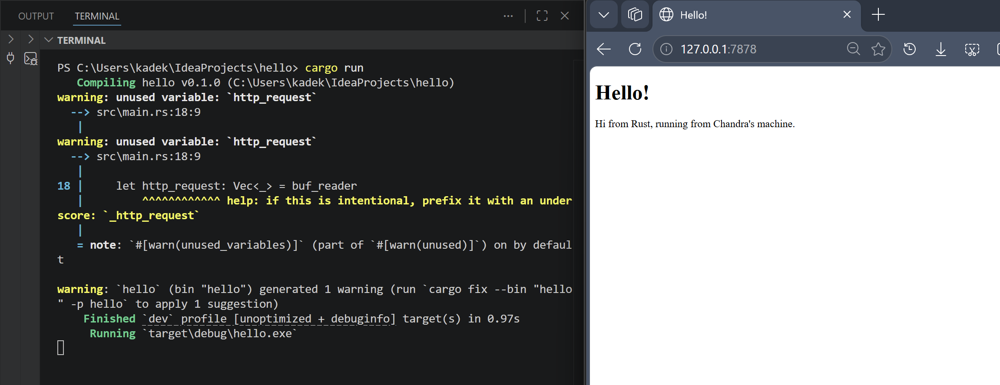

## Commit 1 Reflection notes

Fungsi `handle_connection` bertugas secara spesifik untuk memproses aliran data dari koneksi TCP yang diterima server saat browser mengirimkan request. Di dalam fungsi ini, `TcpStream` dibungkus menggunakan `BufReader` untuk membaca data secara lebih efisien melalui mekanisme buffering. Selanjutnya, variabel `http_request` melakukan iterasi untuk membaca request HTTP baris demi baris dan mengumpulkannya ke dalam struktur data Vector. Proses pembacaan baris ini diinstruksikan untuk berhenti ketika menemukan baris kosong menggunakan `take_while`, karena baris kosong merupakan penanda standar berakhirnya bagian header pada HTTP request. Terakhir, request yang berhasil dibaca dicetak ke terminal menggunakan `println!`, memungkinkan verifikasi langsung terhadap detail informasi yang dikirimkan client seperti HTTP method (misalnya GET), Host, dan User-Agent.

## Commit 2 Reflection notes

Fungsi `handle_connection` dimodifikasi agar mampu memberikan respons balik ke browser, bukan sekadar mencetak request di terminal. Perubahan utama adalah penggunaan `fs::read_to_string("hello.html")` untuk membaca konten dari file HTML eksternal ke dalam memori. Didefinisikan `status_line` sebagai "HTTP/1.1 200 OK" untuk menandakan bahwa permintaan berhasil diproses oleh server. Selain itu, variabel `length` digunakan untuk menghitung ukuran konten HTML, yang kemudian dimasukkan ke dalam header `Content-Length` agar browser mengetahui batasan data yang dikirimkan. Seluruh komponen tersebut (status line, header, dan konten) digabungkan menjadi satu string utuh menggunakan makro `format!`. Lalu, respons tersebut dikirimkan kembali ke client melalui `stream.write_all` setelah diubah menjadi array of bytes, sehingga halaman web dapat dirender dengan baik di sisi browser.

