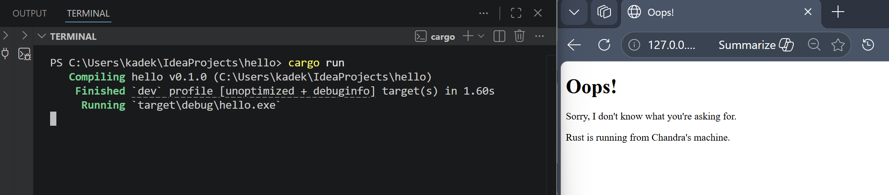

## Commit 1 Reflection notes

Fungsi `handle_connection` bertugas secara spesifik untuk memproses aliran data dari koneksi TCP yang diterima server saat browser mengirimkan request. Di dalam fungsi ini, `TcpStream` dibungkus menggunakan `BufReader` untuk membaca data secara lebih efisien melalui mekanisme buffering. Selanjutnya, variabel `http_request` melakukan iterasi untuk membaca request HTTP baris demi baris dan mengumpulkannya ke dalam struktur data Vector. Proses pembacaan baris ini diinstruksikan untuk berhenti ketika menemukan baris kosong menggunakan `take_while`, karena baris kosong merupakan penanda standar berakhirnya bagian header pada HTTP request. Terakhir, request yang berhasil dibaca dicetak ke terminal menggunakan `println!`, memungkinkan verifikasi langsung terhadap detail informasi yang dikirimkan client seperti HTTP method (misalnya GET), Host, dan User-Agent.

## Commit 2 Reflection notes

Fungsi `handle_connection` dimodifikasi agar mampu memberikan respons balik ke browser, bukan sekadar mencetak request di terminal. Perubahan utama adalah penggunaan `fs::read_to_string("hello.html")` untuk membaca konten dari file HTML eksternal ke dalam memori. Didefinisikan `status_line` sebagai "HTTP/1.1 200 OK" untuk menandakan bahwa permintaan berhasil diproses oleh server. Selain itu, variabel `length` digunakan untuk menghitung ukuran konten HTML, yang kemudian dimasukkan ke dalam header `Content-Length` agar browser mengetahui batasan data yang dikirimkan. Seluruh komponen tersebut (status line, header, dan konten) digabungkan menjadi satu string utuh menggunakan makro `format!`. Lalu, respons tersebut dikirimkan kembali ke client melalui `stream.write_all` setelah diubah menjadi array of bytes, sehingga halaman web dapat dirender dengan baik di sisi browser.

## Commit 3 Reflection notes

Saya menambahkan fitur validasi request dengan memeriksa baris pertama HTTP request (`request_line`). Jika request berupa `"GET / HTTP/1.1"`, server merespons dengan `hello.html` (status 200 OK). Namun, jika user mengakses path lain seperti `/bad`, server akan mengembalikan `404.html` (status 404 NOT FOUND) . 

Dalam implementasinya, saya melakukan *refactoring* menggunakan blok `if-else` untuk mengekstrak `status_line` dan `filename` ke dalam tuple. Refactoring ini sangat krusial untuk mencegah duplikasi kode. Mengingat proses membaca file ke string, menghitung ukuran konten, dan merakit format string respons HTTP memiliki langkah-langkah yang persis sama baik untuk halaman sukses maupun error, kita cukup mendefinisikan logika tersebut satu kali di bagian akhir fungsi `handle_connection`. Hal ini membuat struktur program menjadi jauh lebih bersih, ringkas, dan mudah di-maintain.

## Commit 4 Reflection notes

Pada Milestone 4, menyimulasikan masalah utama dari arsitektur *single-threaded server* dengan menambahkan *endpoint* `/sleep` yang secara sengaja menunda eksekusi selama 10 detik menggunakan `thread::sleep`. Ketika saya mengakses  `/sleep` di satu *tab* browser dan dengan cepat mengakses *root* `/` di *tab* lain, saya mengamati bahwa *tab* kedua mengalami *blocking* dan harus menunggu hingga pemrosesan *tab* pertama selesai. Hal ini terjadi karena server hanya memiliki satu *thread* utama, ia harus menyelesaikan satu *request* secara penuh sebelum bisa menarik *request* berikutnya dari antrean TCP. Simulasi ini membuktikan bahwa *single-thread* sangat buruk untuk skalabilitas di dunia nyata. Satu *request* yang memakan waktu lama (seperti query *database* atau pemanggilan API eksternal) akan menciptakan *bottleneck* yang memblokir seluruh pengguna lain. Pengalaman ini menjadi motivasi krusial perlunya implementasi *Multi-Threading* (seperti penggunaan *Thread Pool*) atau *Asynchronous Programming* (*async/await*) agar server mampu menangani ribuan koneksi secara konkuren dan *non-blocking*.

## Commit 5 Reflection notes

Saya mengimplementasikan `ThreadPool` untuk menyelesaikan masalah *blocking* pada server *single-threaded*. `ThreadPool` bekerja dengan cara membuat sekumpulan *thread* (*workers*) dalam jumlah terbatas (misalnya 4 *thread*) yang sudah di-*spawn* sejak server pertama kali berjalan. Untuk mendistribusikan *request* dari antrean utama ke para *workers*, saya menggunakan mekanisme pesan melalui *channel* `mpsc` (Multiple Producer, Single Consumer). 

*Thread* utama bertindak sebagai pengirim (*sender*) yang membungkus fungsi `handle_connection` ke dalam *closure* (`Job`) dan mengirimkannya melalui *channel*. Di ujung lain, para *workers* menggunakan *pointer* referensi yang aman (`Arc<Mutex<Receiver>>`) untuk mengunci dan mengambil pekerjaan dari *channel* satu per satu tanpa terjadi *race condition*. Dengan arsitektur ini, ketika *request* lambat seperti `/sleep` masuk, ia hanya akan mengunci satu *worker*. *Worker* lain yang sedang siaga bisa langsung mengambil dan merespons *request* baru yang masuk secara konkuren. Arsitektur ini sukses meningkatkan *throughput* server dan mencegah terjadinya *bottleneck* total seperti pada simulasi di Milestone 4.